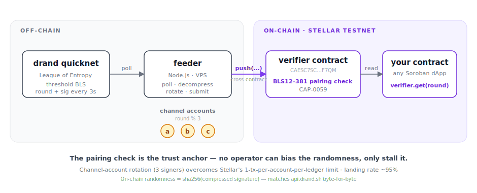

# Drand-Relay — Beacon for Stellar

A trustless randomness relay that brings [drand](https://drand.love) onto Stellar. Any Soroban contract can read provably unbiased, verifiable randomness with a single cross-contract call.

**▶ Try the live demo: https://kaankacar.github.io/Drand-Relay/** — no wallet needed for the Randomness or Beacon Feed tabs.

The on-chain randomness stored by the verifier is `sha256(compressed_signature)` — exactly the value `api.drand.sh` publishes for the same round. Anyone can cross-check what's on-chain against the public drand API.

---

## Canonical Stellar testnet deployment

Beacon runs as a public testnet service — **you don't need to deploy anything**. Just point your contract at the verifier address below and read randomness:

| | |
|---|---|
| **Live demo** | https://kaankacar.github.io/Drand-Relay/ |
| **Verifier contract** | `CAESC7SC5EW5P2P3IM5Q7E64ZNDATVSN5F57NTCH5E7GJRPDM76KF7QM` |
| **Dice game (demo contract)** | `CCBHSZD3AR6DQMPXBUAT5RELARIMFPZEN6ZLC3SIHU6UQOLUCB35LYUI` |
| **Feeder REST API** | `https://stellardrand.duckdns.org` *(live, pushing a fresh round every ~3s)* |
| **Network** | Stellar testnet |
| **drand source** | quicknet · `bls-unchained-g1-rfc9380` · 3s period |

Quick sanity check:

```bash
curl -s https://stellardrand.duckdns.org/random | jq
# → { round, randomness, timestamp }
```

Live demo SPA exercising every endpoint and the dice game: see [`demo/`](demo/) — `cd demo && npm install && npm run dev`. The defaults already point at the canonical deployment.

You only need to "run your own" if you want a dedicated verifier/feeder (own custody, mainnet, custom drand chain). See **[`docs/RUNBOOK.md`](docs/RUNBOOK.md)** for testnet self-hosting or **[`docs/MAINNET.md`](docs/MAINNET.md)** for mainnet.

---

## Architecture at a glance

<p align="center"></p>

---

## How to fetch randomness

Three places randomness shows up: inside a Soroban contract (the main use case), from off-chain code (an SDK or curl), and from a browser frontend.

### From a Soroban smart contract (Rust)

No crate dependency on `drand-verifier` is needed — define the interface inline and call across contracts:

```rust
use soroban_sdk::{contractclient, Address, BytesN, Env, contract, contractimpl};

#[contractclient(name = "DrandVerifierClient")]
pub trait DrandVerifier {
    fn get(env: Env, round: u64) -> Option<BytesN<32>>;
    fn latest(env: Env) -> Option<(u64, BytesN<32>)>;
}

const VERIFIER: &str = "CAESC7SC5EW5P2P3IM5Q7E64ZNDATVSN5F57NTCH5E7GJRPDM76KF7QM"; // canonical testnet

#[contract]
pub struct MyApp;

#[contractimpl]
impl MyApp {
    /// Read the freshest randomness available on-chain.
    pub fn latest_randomness(env: Env) -> BytesN<32> {
        let verifier = Address::from_str(&env, VERIFIER);
        let client   = DrandVerifierClient::new(&env, &verifier);
        let (_round, rand) = client.latest().expect("no rounds verified yet");
        rand
    }
}
```

For anything where the outcome matters (lotteries, raffles, games), use **commit/reveal** so users can't pick a favourable round after seeing it:

```rust
const GENESIS: u64 = 1_692_803_367;  // drand quicknet genesis
const PERIOD:  u64 = 3;              // seconds per round
const BUFFER:  u64 = 10;             // commit at least 10 rounds (≈30s) ahead

// Phase 1: commit to a future round (randomness doesn't exist yet)
pub fn commit(env: Env, user: Address, target_round: u64) {
    user.require_auth();
    let now     = env.ledger().timestamp();
    let current = now.saturating_sub(GENESIS) / PERIOD + 1;
    assert!(target_round >= current + BUFFER, "round must be in the future");
    env.storage().persistent().set(&user, &target_round);
}

// Phase 2: reveal after the feeder has pushed target_round
pub fn reveal(env: Env, user: Address) -> u32 {
    let round: u64 = env.storage().persistent().get(&user).unwrap();
    let verifier   = Address::from_str(&env, VERIFIER);
    let client     = DrandVerifierClient::new(&env, &verifier);
    let rand       = client.get(&round).expect("round not yet available");
    (rand.get(0).unwrap() % 100) as u32  // 0–99
}
```

**Why commit to a future round?** If you used the current round's randomness directly, anyone could look it up before submitting their transaction and pick whichever round gives them the result they want. Committing to a round that doesn't exist yet makes the outcome unknowable at commit time.

For a complete working example, see [`contracts/dice-game/src/lib.rs`](contracts/dice-game/src/lib.rs).

### From off-chain code (JavaScript / Rust / Python)

If you just want the verified randomness server-side, the feeder REST API or the Stellar SDK both work:

```typescript
// Option 1 — feeder REST (simpler, no Soroban dependency)
const res = await fetch("https://stellardrand.duckdns.org/random");
const { round, randomness, timestamp } = await res.json();

// Option 2 — read directly from the chain (verifies on-chain state yourself)
import * as StellarSdk from "@stellar/stellar-sdk";
const rpc = new StellarSdk.rpc.Server("https://soroban-testnet.stellar.org");
const account  = await rpc.getAccount(SOME_TESTNET_ADDRESS);
const verifier = new StellarSdk.Contract("CAESC7SC5EW5P2P3IM5Q7E64ZNDATVSN5F57NTCH5E7GJRPDM76KF7QM");
const tx = new StellarSdk.TransactionBuilder(account, {
    fee: "100",
    networkPassphrase: StellarSdk.Networks.TESTNET,
  })
  .addOperation(verifier.call("latest"))
  .setTimeout(30)
  .build();
const sim = await rpc.simulateTransaction(tx);
const [round, randomness] = StellarSdk.scValToNative(sim.result!.retval);
```

Both return the same 32 bytes — the REST API is forwarding what's in contract storage.

### From a frontend (browser)

```typescript
// Latest round
const latest = await fetch("https://stellardrand.duckdns.org/random").then(r => r.json());

// A specific round (404 if the feeder hasn't pushed it yet)
const r12345 = await fetch("https://stellardrand.duckdns.org/random/12345").then(r => r.json());

// Last 50 rounds (newest first)
const feed = await fetch("https://stellardrand.duckdns.org/feed").then(r => r.json());
```

CORS is enabled with `Access-Control-Allow-Origin: *`, so calls from any origin work.

For commit/reveal flows, poll until the target round shows up:

```typescript
async function waitForRound(target: number): Promise<void> {
  while (true) {
    const res = await fetch(`https://stellardrand.duckdns.org/random/${target}`);
    if (res.ok) return;
    await new Promise(r => setTimeout(r, 3000));
  }
}
```

The [`demo/`](demo/) app demonstrates the full pattern with a working dice game.

---

## How does it verify randomness

The verifier contract runs a real BLS12-381 pairing check on-chain using Soroban's CAP-0059 host function (Protocol 22+). The relay is **trustless w.r.t. the feeder** — a malicious feeder cannot lie about what drand produced; it can only stall.

### The five-step verification

For every `push(round, sig_compressed, sig_uncompressed)` call:

```
1. Bind compressed ↔ uncompressed encoding
   ┌──────────────────────────────────────────────────────────────┐
   │  c[0] high bits == 0b100   (compressed flag set, not infty)  │
   │  c[0] & 0x1f == u[0]       (X-byte 0 with flag bits stripped)│
   │  c[1..48] == u[1..48]      (X bytes match)                   │
   │  (c[0] >> 5) & 1 == (u.Y > p/2 ? 1 : 0)   (y-sign matches)   │
   └──────────────────────────────────────────────────────────────┘
   Fails fast (cheap) if the feeder tried to pair a real point with
   bogus compressed bytes. This binding is what guarantees stored
   randomness == sha256(real signature).

2. Build the message
   msg = sha256(round as big-endian u64)

3. Hash to G1 with drand quicknet's domain separation tag
   DST = "BLS_SIG_BLS12381G1_XMD:SHA-256_SSWU_RO_NUL_"
   H(msg) = hash_to_g1(msg, DST)        // RFC 9380, SSWU

4. Pairing check (the trust anchor)
   e(σ, -g2_gen) · e(H(msg), pk_drand) == 1
   ≡ e(σ, g2_gen) == e(H(msg), pk_drand)        // standard BLS verify
   Implemented as Soroban host function bls.pairing_check(vp1, vp2)

5. Derive randomness from the canonical encoding
   if pairing OK:
       randomness[round] = sha256(sig_compressed)
                                  ↑ 48-byte canonical drand encoding
   Matches api.drand.sh's `randomness` field byte-for-byte.
```

### Why this is secure

| Threat | Defence |
|--------|---------|
| Feeder submits a forged signature | Pairing check fails → `push` returns false, nothing stored |
| Feeder swaps compressed bytes to bias randomness | Step 1 binding rejects the call before pairing runs |
| Validator picks a favourable round | Drand round numbers are dictated by time (genesis + round × 3s); validators can't reorder them |
| User picks a favourable round | Commit/reveal — user must commit before the round exists |
| Feeder goes offline | Liveness only — past randomness stays on-chain, no bias possible |
| Drand network is compromised | Requires ≥⅔ of League of Entropy (Cloudflare, Protocol Labs, EPFL, …) collusion |

The relay's only trust assumption is in drand's threshold BLS, not in any operator of this codebase.

### Anyone can independently re-verify

The verification math is reproducible. For any round N, anyone can fetch the signature from `api.drand.sh`, run the BLS pairing check themselves (e.g. with `@noble/curves` or `arkworks`), and confirm the bytes in contract storage exactly equal `sha256(those 48 bytes)`. The demo's "How It Works" tab walks through this.

The contract's [test suite](contracts/drand-verifier/src/lib.rs#L260) includes a regression test that asserts on-chain stored randomness == drand's published value byte-for-byte for a known round.

---

## How the feeder keeps up with drand

drand publishes a new round every **3 seconds**. Stellar caps each source account at **1 transaction per ledger**, and ledgers close every ~5 seconds (a Soroban-era protocol rule covering all tx submission). So a single signer maxes out at ~12 push/min vs drand's 20 round/min — it would drop ~40% of rounds before they ever reach the chain.

The fix is Stellar's standard **channel-accounts pattern**: rotate signing across multiple source accounts so each round goes to a different signer, sidestepping the per-account-per-ledger cap.

```
drand round N    →  ch-a.push()       (ledger M includes 1 tx from ch-a)
drand round N+1  →  ch-b.push()       (ledger M includes 1 tx from ch-b)
drand round N+2  →  ch-c.push()       (ledger M includes 1 tx from ch-c)
drand round N+3  →  ch-a.push()       (ledger M+1)
…
```

The canonical testnet feeder uses **3 channel accounts** rotated by `round % 3`. Each keypair maintains its own pre-incremented sequence cache and submits fire-and-forget (no per-tx confirmation polling — that's what made the single-signer version slow). On any submission error, that channel's sequence cache is dropped so the next attempt re-reads from the network.

| Metric | Value |
|---|---|
| Theoretical capacity | 3 channels × 1 tx / 5s = ~36 push/min |
| drand rate | 20 round/min |
| Observed landing rate | **~95%** steady-state |
| Failed tx | 0 |

The remaining ~5% miss rate comes from fire-and-forget's inherent blind spot — submitted tx's that land in mempool but get dropped at ledger close before we'd know. Closing the last ~5pp would require an async confirm tracker + retry-on-different-channel logic; for testnet this is left as a "later if needed" optimisation, since dApps using commit/reveal target a future round + buffer and don't care which specific round arrived.

Setup details (channel-account creation, env wiring, deploying with Docker Compose) are in [`docs/RUNBOOK.md`](docs/RUNBOOK.md).

---

## Why we need this

Soroban's built-in `env.prng()` is seeded from the ledger hash — all transactions in the same ledger see the same value, and validators can bias the output. Soroban contracts also can't make HTTP calls, so there was no way to bring external randomness on-chain without a relay.

Beacon solves this by **verifying** drand's threshold BLS signature on-chain (rather than trusting any operator to provide bytes). The math is the trust anchor; an attacker would have to break ≥⅔ of the League of Entropy.

---

## Operating costs

The feeder pays a Soroban transaction fee per `push`. Measured on testnet over many consecutive pushes against the live canonical deployment:

| | Stroops | XLM |
|---|---|---|
| Fee per push | 45,475 | 0.0045475 |
| Per day (28,800 pushes) | 1,309,680,000 | ~130.97 |
| Per week | ~9,168,000,000 | ~916.8 |
| Per month (30 days) | ~39,290,400,000 | ~3,929 |
| Per year | ~478,033,200,000 | ~47,803 |

Converted to USD at three different XLM price points:

| XLM price | Weekly | Monthly | Yearly |
|---|---|---|---|
| $0.10 | $92 | $393 | $4,780 |
| $0.15 | $138 | $589 | $7,170 |
| $0.40 | $367 | $1,572 | $19,120 |

The 28,800 push/day figure assumes 100% landing rate. With the observed ~95% steady-state rate the actual spend is ~5% lower — Stellar only charges for tx's that actually land in a ledger, so mempool-dropped attempts don't burn fees. Practical spend is closer to **~125 XLM/day** total across the 3 channel accounts.

Total network spend is **the same as a single-signer setup** — channel accounts split the tx volume across multiple signers, they don't multiply spend. Each channel handles roughly 1/3 of the daily push count.

**Testnet is free** (channel accounts get refilled by friendbot on a weekly cron). The numbers above only matter if you run a **mainnet** deployment — see [`docs/MAINNET.md`](docs/MAINNET.md) for funding strategy and best practices.

Mainnet fees may differ slightly from testnet (validators are the same code so resource fees match; only the base inclusion fee differs, which is tiny relative to the pairing-check resource cost). Plan with a 20% buffer just in case.

---

## Project structure

```
Drand-Relay/
├── contracts/
│   ├── drand-verifier/      # BLS12-381 on-chain verifier (Soroban / Rust)
│   └── dice-game/           # Commit/reveal dice game using the verifier
├── feeder/
│   ├── Dockerfile           # build + run feeder in a container
│   ├── docker-compose.yml   # one-shot deploy with restart policy
│   └── src/
│       ├── index.ts         # Poll loop + push queue
│       ├── drand.ts         # drand API client
│       ├── soroban.ts       # Transaction builder + submitter
│       └── server.ts        # Express REST API
├── demo/                    # React SPA showing the full flow (see demo/README.md)
├── docs/
│   ├── RUNBOOK.md           # Step-by-step VPS deploy (testnet)
│   └── MAINNET.md           # Mainnet deploy + operating guide
└── Cargo.toml               # Rust workspace
```

---

## Running your own deployment

The shared testnet endpoint above is enough for most use cases. Run your own when you want isolated key custody, a mainnet deployment, or a custom drand chain.

| Where | Guide |
|-------|-------|
| Testnet on any Linux VPS | [`docs/RUNBOOK.md`](docs/RUNBOOK.md) — written for someone who has never touched a Linux server, every command explained |
| Mainnet | [`docs/MAINNET.md`](docs/MAINNET.md) — extra steps: key custody, fee funding, monitoring |
| Local dev | See "Local quickstart" below |

### Local quickstart

Prerequisites: Rust 1.84+ with `wasm32v1-none` target (`rustup target add wasm32v1-none`), [Stellar CLI](https://developers.stellar.org/docs/tools/stellar-cli), Node.js 20+ (or Docker).

```bash
# Build contracts
cargo build --release --target wasm32v1-none

# Deploy verifier
stellar keys generate feeder --network testnet --fund
stellar contract deploy \
  --wasm target/wasm32v1-none/release/drand_verifier.wasm \
  --source feeder --network testnet
# → save as VERIFIER_CONTRACT_ID

# Configure and run the feeder
cp feeder/.env.example feeder/.env
# Edit .env: fill in FEEDER_SECRET_KEY and VERIFIER_CONTRACT_ID
cd feeder && docker compose up -d --build

# Test it
curl -s http://localhost:3001/random
```

---

## Feeder REST API

| Endpoint | Description |
|----------|-------------|
| `GET /random` | Latest verified round `{ round, randomness, timestamp }` |
| `GET /random/:round` | Specific round (404 if not yet verified on-chain) |
| `GET /feed` | Last 50 verified rounds, newest first |

All responses are JSON. CORS is open (`Access-Control-Allow-Origin: *`).

---

## drand quicknet details

| Property | Value |
|----------|-------|
| Chain hash | `52db9ba70e0cc0f6eaf7803dd07447a1f5477735fd3f661792ba94600c84e971` |
| Scheme | `bls-unchained-g1-rfc9380` |
| Period | 3 seconds |
| Signature | G1, 48 bytes compressed |
| Public key | G2, 96 bytes |
| Genesis | 1692803367 (Unix) |

---

## Tech stack

- **Contracts**: Soroban (Rust), `soroban-sdk 25.3.1`
- **Feeder**: Node.js, TypeScript, `@stellar/stellar-sdk 15.0.1`, `@noble/curves`
- **Demo**: React 18, Vite, Tailwind CSS, StellarWalletsKit v2
- **Cryptography**: BLS12-381 pairing check (CAP-0059), hash-to-curve RFC 9380
