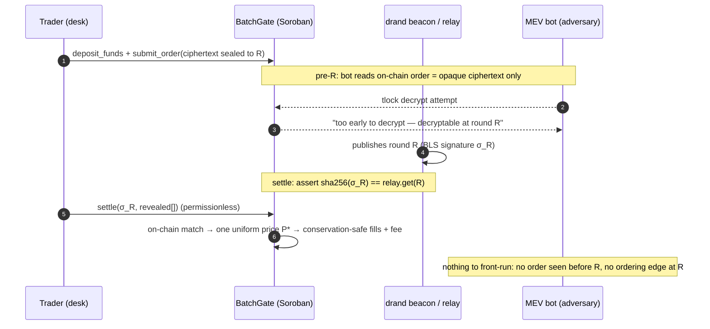

<div align="center">

# Stelvin

**A sealed-bid, uniform-price batch DEX on Stellar Soroban.**

Orders are **drand-timelock-encrypted** and unreadable by anyone — the operator and
settler included — until a committed drand round `R`; then the **whole batch clears
on-chain at one fair price**. A front-runner has nothing to see before reveal and no
ordering edge at settlement, so **MEV isn't promised away — it's cryptographically
impossible to react to.**

Fair execution for active Stellar DeFi traders today · the on-chain dark pool for
tokenized-RWA & institutional flows next.

**Tracks: Main (automatic) + Privacy (primary)** · Build on Stellar — IBW 2026

[**▶ Live app**](https://stelvin-six.vercel.app) · [**Live demo**](https://stelvin-six.vercel.app/#/demo) · [**Docs**](https://stelvin-six.vercel.app/#/docs) · [Judge writeup](./SUBMISSION.md) · [19 ADRs](./DECISIONS.md)

</div>

---

## Links

| | |
|---|---|
| 🎥 **Pitch video** | <https://youtu.be/KT6lK-5Y_OQ> |
| 🖥️ **Live app** | <https://stelvin-six.vercel.app> |
| ▶️ **Live demo** | <https://stelvin-six.vercel.app/#/demo> |
| 📚 **In-app docs** | <https://stelvin-six.vercel.app/#/docs> |
| 📑 **Pitch deck (slides)** | <https://drive.google.com/file/d/1BQ2ezKEJLHHSCwt7VyyUPVNGM5dxWG2f/view> |
| 🔌 **Demo backend** | <https://stelvin-backend-production.up.railway.app> |
| 💻 **Source** | <https://github.com/mericcintosun/stelvin> |

**On-chain — verify it yourself on [stellar.expert](https://stellar.expert/explorer/testnet) (testnet):**

- **BatchGate** (our contract) — [`CAFQ…STQE`](https://stellar.expert/explorer/testnet/contract/CAFQP734PFBBUCQQCD2NXUB6CDTXCWAHYT4ZUWJM5FNKOUBZPSM7STQE)
- **tUSTB SAC** — [`CAUD…DZQU`](https://stellar.expert/explorer/testnet/contract/CAUDJW4XV2AFXCNUYVHU6IIM5D27745Z6NYFH5PGSTFDYAGQJO5BDZQU) · **USDC SAC** — [`CAE7…GBBO`](https://stellar.expert/explorer/testnet/contract/CAE7ERCVPJ5MIC7TI3PRDBNMXD4WYIZV7A6Q5ZR33QVDRV2364JLGBBO)
- **Drand-Relay** (called, not redeployed) — [`CAES…7QM`](https://stellar.expert/explorer/testnet/contract/CAESC7SC5EW5P2P3IM5Q7E64ZNDATVSN5F57NTCH5E7GJRPDM76KF7QM)
- **Noether SEP-40 oracle** (called) — [`CBDH…SBS4`](https://stellar.expert/explorer/testnet/contract/CBDH7R4PBFHMN4AER74O4RG7VHUWUMFI67UKDIY6ISNQP4H5KFKMSBS4)

---

## Table of contents

- [The problem](#the-problem)
- [The solution — two layers](#the-solution--two-layers)
- [The demo, in real numbers](#the-demo-in-real-numbers)
- [Architecture](#architecture)
- [Order lifecycle](#order-lifecycle)
- [The contract (`BatchGate + Escrow`)](#the-contract-batchgate--escrow)
- [Settlement, step by step](#settlement-step-by-step)
- [Trust boundary & honesty](#trust-boundary--honesty-the-heart-of-the-project)
- [Privacy disclosures](#privacy-disclosures-track-requirement)
- [What's genuinely new](#whats-genuinely-new)
- [Run & verify](#run--verify)
- [Deployed (testnet)](#deployed-testnet)
- [Repo layout](#repo-layout)
- [Status & roadmap](#status--roadmap)
- [Acknowledgements](#acknowledgements)

---

## The problem

On any transparent exchange, the moment you send an order it's visible in the
mempool / order book. Bots see it, **jump ahead (front-running)** and **bend the
price against you (sandwiching)**. Billions of dollars per year are extracted this
way. A bot can only react to an order it can **see** — so Stelvin makes orders
physically invisible until they clear.

**Scope of the claim (precise).** *Intra-batch* front-running and sandwiching are
**cryptographically eliminated**: within a batch no order is visible and a single
uniform clearing price removes any ordering advantage. Cross-batch effects (a
cleared price informing the next batch) and uniform-auction game theory are ordinary
public-market phenomena — not victim-specific MEV — and are explicitly out of scope.

---

## The solution — two layers

Stelvin protects with **two layers**, and we're precise about what each does:

1. **Timelock encryption — hides order *contents* before reveal.**
   Traders encrypt `{side, amount, limit_price}` to a future drand round `R` with
   `tlock` (Boneh-Franklin **IBE over BLS12-381**, drand quicknet
   `bls-unchained-g1-rfc9380`). The decryption key is held by **no one** — it is
   produced by a live, decentralized beacon only when round `R` is published. Not
   the operator, not the settler, can read an order before `R`.

2. **Uniform-price batch clearing — removes the ordering edge at settlement.**
   At `R` the whole batch clears at a single price `P*` that the **contract**
   computes (not the settler), so there is no "first in line" advantage and the
   settler cannot move the price. Reference: Budish *Frequent Batch Auctions*.

> The first layer is what the bot demo proves on-chain; the second is what makes
> the clearing fair and settler-proof.

---

## The demo, in real numbers

One front-runner bot, run against two markets — an institutional **tUSTB/USDC**
(tokenized US T-bill) block trade. Run it yourself: `cd settler && npm run demo`
(~90s, live testnet) or watch it in the browser at **[/#/demo](https://stelvin-six.vercel.app/#/demo)**.

| Market | What happens | Result |
|---|---|---|
| **Transparent AMM** (simulated, real constant-product mechanics) | The bot sees a visible block order and sandwiches it | **bot +315.07 USDC** · **desk −268.07 tUSTB** to slippage |
| **Stelvin** (live on testnet, permissioned/KYC) | The *same* bot pulls the real on-chain ciphertext and runs `tlock` decrypt → *"too early… decryptable at round R"* on every attempt → the beacon publishes `R` → the batch settles at **P\* = $1.00 (par/NAV)** | alice **+10,000 tUSTB**, bob **+9,998 USDC** (net of a **2 bps** venue fee; 2 USDC accrues to the protocol) · **front-run attempts: 0 successful** |

A recorded fallback run is in [`demo/sample-run.txt`](./demo/sample-run.txt).

---

## Architecture

Three parts we build, plus two external dependencies we only *call*:

```
Frontend / settler (TS)            Soroban (Rust)                    drand quicknet
React/Vite + tlock-js encrypt ─►   BatchGate + Escrow (our work)     (live beacon)
deposit / submit / withdraw        - opaque ciphertext store               │
Freighter wallet (Phase B)         - standing-balance escrow               │ raw 48B sig
                                   - timing gate + key auth  ◄─────────────┘
Drand-Relay (live) ──get(R)──►     - on-chain uniform-price match
 = timing/key oracle               - conservation-safe settlement + fee
 (Kaan Kaçar's; we only call)      - on-chain BLS12-381 verify (relay-trustless)
Noether SEP-40 oracle ──get_price──► (display-only fair-value reference)
```

| Layer | What | Tech |
|---|---|---|
| **Contract** (our work) | `BatchGate + Escrow`: sealed orders, standing-balance escrow, timing/key gate, on-chain uniform-price matching, conservation-safe settlement, KYC gate, protocol fee, native BLS verify | Rust / Soroban (`wasm32v1-none`) |
| **Settler + demo** (our work) | encrypt-to-round, decrypt the batch at reveal, call `settle()`; SSE demo backend; frontrunner-bot; public auditor | `tlock-js` (BLS12-381 IBE) + TypeScript |
| **Frontend** (our work) | landing (scroll-video hero) + live demo + docs + Freighter wallet | React / Vite |
| **Drand-Relay** (we only call) | timing + key authenticity — runs a full on-chain BLS pairing check before storing each round | [Drand-Relay](./Drand-Relay) (Kaan Kaçar's; not redeployed) |
| **Noether oracle** (we only call) | display-only fair-value reference, strictly non-blocking | SEP-40 on-chain oracle |

---

## Order lifecycle



Anyone can independently re-decrypt every settled order from the public `σ_R`
(`cd settler && npm run verify`, or the in-app **"Verify independently"** button) —
settlement is v1-optimistic but **publicly auditable**, by construction.

---

## The contract (`BatchGate + Escrow`)

`contracts/batch-gate/` — Rust/Soroban, `soroban-sdk 25.3.1`, target `wasm32v1-none`.
**25/25 unit tests**, wasm **31,531 bytes**.

| fn | auth | purpose |
|---|---|---|
| `__constructor(admin, asset_base, asset_quote, relay)` | deploy | one-time config |
| `deposit_funds(trader, asset, amount)` | trader | fund standing balance (SAC pull); KYC-gated when permissioned |
| `withdraw(trader, asset, amount)` | trader | withdraw free balance (SAC push) |
| `create_batch(reveal_round) -> u32` | admin | open a batch for round `R` (≥ `est_round + 12`) |
| `submit_order(trader, batch_id, ciphertext) -> u64` | trader | sealed order; funded balance required; one per trader per batch; KYC-gated |
| `lock_batch(batch_id)` | permissionless | freeze once `R` is available |
| `settle(batch_id, sigma_r, revealed[])` | permissionless | timing/key gate → match → conservation-safe settlement + fee |
| `verify_round_signature(round, sig) -> bool` | view | **independent on-chain BLS12-381 verification** of the drand signature — relay-trustless |
| `set_permissioned(enabled)` / `set_kyc(trader, allowed)` | admin | RWA/KYC allowlist (default off = backward-compatible) |
| `set_fee_bps(bps)` / `withdraw_fees(to, asset, amount)` | admin | protocol fee (default 0, cap 1000) — conservation-safe, quote-leg only |
| `get_batch / get_order / get_clearing / get_balance / get_permissioned / is_kyc / get_fee_bps / get_fees` | view | reads |

**Core invariants (don't regress — they're the project's claims):**
- **Conservation:** `Σbuy_base == Σsell_base`; the quote pool can only retain dust
  (buyers pay ceil, sellers receive floor), never go negative — even with the fee.
- **Revert-proof settle:** a global feasibility scalar `r` + floor-then-trim +
  one-order-per-trader-per-batch guarantee `settle` never reverts and never
  mints/burns value.
- **On-chain uniform price:** the settler never sets the price.
- **Griefing guard:** an eligible order funded for `<1%` of its own size is
  excluded, so a huge-amount/near-zero-funding order can't collapse the batch.

---

## Settlement, step by step

`settle(batch_id, sigma_r, revealed[])` is permissionless:

1. **Timing + key gate (one relay read).** `committed = relay.get(R)` returning
   `Some` simultaneously proves round `R` arrived *and* the committed key is
   authentic (the relay BLS-verified it). Then assert `sha256(sigma_r) == committed`.
   The same 48-byte compressed `sigma_R` is both the tlock decryption key and this
   on-chain check — one fetch serves both.
2. **Reveal trust (v1-optimistic).** Trust that `revealed[]` are the correct
   decryptions — but the **trader is always read from storage**, duplicate
   `order_id`s are rejected, and `amount`/`limit_price` are bounded (overflow caps).
3. **Clearing price `P*`.** Scan the candidate prices (= submitted limit prices),
   pick the one maximizing matched volume (tie-break: smaller `|demand−supply|`,
   then lower price).
4. **Conservation-safe fills.** Global feasibility scalar `r = min_i(feasible_i /
   raw_fill_i)` scales *both* sides equally; floor-then-trim makes `Σbuy == Σsell ==
   traded` exactly; buyers pay `⌈base·P*/SCALE⌉`, sellers receive `⌊·⌋·(1−fee)`; the
   **protocol fee is the non-negative residual**, credited to an admin-withdrawable
   ledger. Base is never touched by the fee.
5. **Record & emit.** Write `Clearing`, set `Settled`, emit `BatchSettled`.

---

## Trust boundary & honesty (the heart of the project)

We state the boundary up front, not buried:

- **Confidentiality is trustless & temporal** — guaranteed by the timelock (secret
  until `R`, public after), not by any operator's promise.
- **The clearing price is trustless** — computed on-chain by the contract.
- **Key authenticity is trustless** — the relay BLS-verifies, *and* our contract can
  independently re-verify the drand signature on-chain via native BLS12-381
  (`verify_round_signature`), so it doesn't even have to trust the relay.
- **Settlement integrity is v1-optimistic but publicly auditable** — the settler is
  trusted to decrypt orders correctly and to include them; because `σ_R` is public
  after `R`, *anyone* can recompute the full decryption and detect a misreported or
  censored order (`npm run verify` / in-app auditor). On-chain fraud-proof
  enforcement is roadmap. **We do not claim "trustless on-chain reveal."**
- **Ecosystem-fit, honestly framed:** the BLS pairing in the live timing gate lives
  in the relay we *call*; our own gate is a cheap `sha256` against its verified
  commitment, plus the optional independent on-chain BLS check above — composition,
  not a borrowed crypto claim.

---

## Privacy disclosures (track requirement)

- **Hidden:** order *contents only* — side (buy/sell), amount, limit price.
- **NOT hidden (stated up front):** participant addresses, order count per batch,
  submission timing. Stelvin hides *what* you trade, not *that* you placed an order.
  Participant-graph privacy is future work.
- **From whom:** all participants **and** the operator/settler — until round `R`.
- **Technique:** drand timelock encryption (`tlock` = Boneh-Franklin IBE / BLS12-381;
  `tlock-js`), drand quicknet (`bls-unchained-g1-rfc9380`, 3s period).
- **Threat model:** a mempool-watching front-running / sandwich / MEV adversary.
  Pre-`R` there is no plaintext to observe; post-`R` everything clears atomically at
  one price.
- **Cryptographic assumptions:** drand quicknet beacon liveness + BLS signature
  unforgeability (+ the relay's permissionless, BLS-verified `push`).
- **Residual leak (honest):** standing-balance funding amount is in cleartext; a user
  who funds to exactly one order's value can leak that size.

---

## What's genuinely new

We're **not** the first MEV-resistant or sealed-order design — CoW, Shutter and
Penumbra exist, and the batch-auction idea is Budish–Cramton–Shim. What is novel and
defensible:

- **First timelock-sealed batch DEX on Soroban / Stellar.**
- **Committee-free:** confidentiality rests on a public drand beacon, not an m-of-n
  keyper committee — no trusted set to collude.
- **One general-purpose Soroban contract** on top of a **live, on-chain
  BLS-verifying** relay — not a bespoke app-chain — and it can **independently verify
  the drand signature on-chain** with native BLS12-381.

| Project | What it does | How Stelvin differs |
|---|---|---|
| **CoW Protocol** (Ethereum) | Batch auction, uniform clearing; solvers off-chain | CoW orders are visible to solvers; Stelvin hides contents from *everyone* (even the settler) cryptographically. |
| **Shutter** (Ethereum/Gnosis) | Threshold-encrypted mempool; keyper committee unseals | Shutter trusts an m-of-n committee; Stelvin uses a committee-free drand beacon. |
| **Penumbra** (Cosmos) | Fully shielded app-chain; batch swaps hide *what* and *who* | More private (hides counterparties); Stelvin is one contract on a general L1, addresses public. |

---

## Run & verify

```sh
# 1) Contract — 25/25 unit tests (incl. conservation, no-revert, KYC, fee,
#    overflow caps, randomized property test, griefing guard, on-chain BLS verify)
cargo test -p batch-gate

# 2) Deploy + end-to-end on testnet, one command (deposit → create_batch → submit
#    → wait for R → fetch sigma → settle; un-KYC'd address rejected on-chain)
bash scripts/deploy_and_smoke.sh

# 3) The frontrunner-bot showdown (live testnet)
cd settler && npm install && npm run demo

# 4) Public auditor — re-decrypt every order of a settled batch from the PUBLIC σ_R
cd settler && npm run verify -- <batch_id>

# 5) Frontend (Vite/React) + demo backend (SSE)
cd web && npm install && npm run dev          # http://localhost:5173
cd settler && npm run server                   # http://localhost:8787
```

The live frontend ([stelvin-six.vercel.app](https://stelvin-six.vercel.app)) talks to
the deployed demo backend on Railway; the demo page is also overridable with
`?backend=https://…`.

---

## Deployed (testnet)

Everything is live and inspectable on
[stellar.expert](https://stellar.expert/explorer/testnet).

| Item | Value |
|---|---|
| **Frontend** | https://stelvin-six.vercel.app |
| **Demo backend** | https://stelvin-backend-production.up.railway.app |
| **BatchGate** (permissioned RWA) | `CAFQP734PFBBUCQQCD2NXUB6CDTXCWAHYT4ZUWJM5FNKOUBZPSM7STQE` |
| **tUSTB SAC** / **USDC SAC** | `CAUDJW4XV2AFXCNUYVHU6IIM5D27745Z6NYFH5PGSTFDYAGQJO5BDZQU` / `CAE7ERCVPJ5MIC7TI3PRDBNMXD4WYIZV7A6Q5ZR33QVDRV2364JLGBBO` |
| **Drand-Relay** (oracle, called) | `CAESC7SC5EW5P2P3IM5Q7E64ZNDATVSN5F57NTCH5E7GJRPDM76KF7QM` |
| **Noether SEP-40 oracle** (called) | `CBDH7R4PBFHMN4AER74O4RG7VHUWUMFI67UKDIY6ISNQP4H5KFKMSBS4` |
| Contract | 25/25 unit tests · wasm 31,531 bytes · `wasm32v1-none` |
| drand chain | quicknet · `bls-unchained-g1-rfc9380` · 3s · `52db9ba7…84e971` |
| Network | testnet · RPC `https://soroban-testnet.stellar.org` |

---

## Repo layout

```
contracts/batch-gate/   BatchGate + Escrow Soroban contract (Rust) — our work
  src/lib.rs            contract; src/test.rs 25 tests; src/drand_consts.rs BLS consts
settler/                TypeScript: settler, SSE demo backend, frontrunner-bot, auditor
  src/lib.ts            shared chain + tlock helpers (+ Noether, KYC, fee reads)
  src/settler.ts        e2e settle · src/server.ts SSE backend · src/frontrunner-bot.ts demo
  src/verify.ts         public auditor (re-decrypt from public σ_R)
web/                    Vite/React: landing (scroll-video hero) + demo + docs + wallet
  src/components/ScrollVideoHero.tsx, WalletPanel.tsx (Phase B), primitives.tsx
  src/pages/{Landing,Demo,Docs}.tsx · src/data/content.ts (single source of copy+addrs)
scripts/deploy_and_smoke.sh   one-command deploy + e2e on testnet
Dockerfile / railway.json     demo backend container (Railway)
DECISIONS.md                  19 ADRs — the canonical "why"
SUBMISSION.md                 judge-facing writeup (criterion → evidence)
Drand-Relay/                  vendored reference oracle (Kaan Kaçar's; we only call it)
```

---

## Status & roadmap

- ✅ **Contract** — sealed orders, standing-balance escrow, on-chain uniform-price
  matching, conservation-safe + revert-proof settlement, drand timing/key gate,
  reveal dedup, lifecycle events, **backward-compatible permissioned KYC allowlist**,
  **conservation-safe protocol fee**, **griefing guard**, **on-chain BLS12-381
  verification**. 25/25 tests; `wasm32v1-none`.
- ✅ **Testnet** — deployed against the live Drand-Relay; one-command e2e smoke test;
  sigma encoding (`sha256(48-byte compressed σ) == relay.get(R)`) CLI-verified.
- ✅ **Settler** — real `tlock` encrypt → submit → unreadable-pre-`R` → decrypt →
  settle, verified e2e on testnet.
- ✅ **Frontrunner-bot demo** — two panels (sandwich vs sealed batch), feeder-resilient.
- ✅ **Web** — Apple-style scroll-video hero, live two-panel demo (SSE), in-app
  **public auditor**, fair-value guardrail, full docs.
- ✅ **Wallet Phase B** — connect Freighter and **deposit / submit a timelock-sealed
  order from your own wallet** (client-side `tlock`), with a demo faucet + on-chain KYC.
- 🔭 **Roadmap (not claimed here):** on-chain fraud-proof / IBE for settlement
  integrity; multi-order-per-trader feasibility; participant-graph privacy; paginated
  settle beyond 16 orders; an agentic bidding agent.

---

## Acknowledgements

[`Drand-Relay/`](./Drand-Relay) is vendored reference code by **Kaan Kaçar** — a live,
on-chain BLS-verifying drand oracle that Stelvin uses purely as a timing/key oracle.
We do not redeploy it; see its own README for attribution. Stelvin also composes with
**Noether's** SEP-40 oracle (SCF #41) as a display-only fair-value reference.

Built for **IBW 2026 — Build on Stellar**. Tracks: **Main** (automatic) + **Privacy**
(primary). Deep rationale in [`DECISIONS.md`](./DECISIONS.md) (19 ADRs); judge-facing
writeup in [`SUBMISSION.md`](./SUBMISSION.md). MIT licensed.
