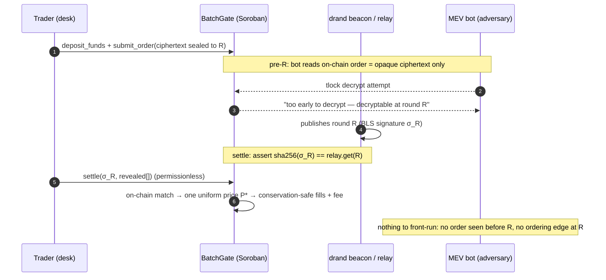

# Stelvin

**A sealed-bid batch DEX on Stellar Soroban: orders are drand-timelock-encrypted
and unreadable by anyone (operator and settler included) until they all clear at
one uniform price. Fair execution for Stellar DeFi traders today; the on-chain
dark pool for tokenized-RWA & institutional flows next. MEV isn't promised away;
it's cryptographically impossible to react to.**

> Tracks: **Main** (automatic) + **Privacy** (primary). Build on Stellar — IBW 2026.
> Judge-facing writeup: **[`SUBMISSION.md`](./SUBMISSION.md)** · deep rationale:
> [`DECISIONS.md`](./DECISIONS.md).

## The demo, in one line

Run one frontrunner bot against two markets (`cd settler && npm run demo`, ~90s, live testnet):

- **Transparent AMM:** bot sandwiches a visible order → **+315 USDC profit, victim loses 268 X.**
- **Stelvin (live):** the same bot pulls the real on-chain order, runs `tlock`
  decrypt, and fails **5×** (*"too early … decryptable at round R"*) → the beacon
  publishes R → the batch settles at **one uniform price** → **0 successful frontruns.**

Recorded run: [`demo/sample-run.txt`](./demo/sample-run.txt).

## How it works (two layers)

1. **Timelock encryption** hides order *contents* before reveal — encrypted to a
   future drand round `R` with `tlock` (BLS12-381 IBE). No one (operator/settler
   included) can read an order until the beacon publishes `R`; the key is held by
   no one.
2. **Uniform-price batch clearing** removes intra-batch ordering advantage — at
   `R` the whole batch clears at a single price the **contract** computes.

**Precise claim:** *intra-batch* frontrunning and sandwiching are cryptographically
eliminated. Cross-batch effects and auction game theory are ordinary public-market
phenomena, not victim-specific MEV — we don't claim otherwise.

## Architecture

| Layer | What | Tech |
|---|---|---|
| **Contract** (our work) | BatchGate + Escrow: sealed orders, standing-balance escrow, timing/key gate, on-chain uniform-price matching, conservation-safe settlement | Rust / Soroban |
| **Encryption / settler** | encrypt-to-round, decrypt the batch at reveal, call `settle()` | `tlock-js` (BLS12-381 IBE, drand quicknet) + TS |
| **Oracle (we only call)** | timing + key authenticity | [Drand-Relay](./Drand-Relay) — live, on-chain BLS-verifying (Kaan Kaçar's; not redeployed) |

The contract is in [`contracts/batch-gate`](./contracts/batch-gate); the settler +
demo in [`settler/`](./settler).

### Lifecycle — the adversary is blind until round R



Anyone can independently re-decrypt every settled order from the public `σ_R`
(`cd settler && npm run verify`) — settlement is v1-optimistic but **publicly
auditable**, by construction.

## Status

- ✅ **M1 — Contract.** `deposit_funds`/`withdraw`, `create_batch`, `submit_order`,
  `lock_batch`, `settle` + on-chain matching, reveal dedup, one-order-per-trader
  guard, lifecycle events, **backward-compatible permissioned KYC allowlist** (RWA),
  **conservation-safe protocol fee** (`fee_bps`). **23/23 unit tests** (conservation +
  no-revert + dedup + KYC gate + fee). `wasm32v1-none`.
- ✅ **RWA pivot.** Asset-agnostic contract → demo trades a tokenized US T-bill
  (tUSTB) vs USDC near par; permissioned (KYC) mode allowlists desks and rejects
  un-KYC'd addresses on-chain; a **2 bps venue fee** accrues on-chain (admin-
  withdrawable). Positioned as an **on-chain dark pool for tokenized RWAs &
  institutional flows**. See [`SUBMISSION.md`](./SUBMISSION.md) for the real-world
  use cases + market & business model (with sources).
- ✅ **M2 — Testnet.** Deployed against the live Drand-Relay; one-command e2e smoke
  test (`scripts/deploy_and_smoke.sh`). Sigma encoding (`sha256(48-byte compressed
  sigma) == relay.get(R)`) CLI-verified.
- ✅ **M3 — Settler.** Real `tlock-js` encrypt → submit → (on-chain ciphertext
  **unreadable before R**) → decrypt at reveal → settle, verified e2e on testnet.
- ✅ **M5 — Frontrunner-bot demo.** Two panels (sandwich vs sealed batch).
- ✅ **M4 (Phase A) — Web UI.** [`web/`](./web): the two panels in the browser,
  live on testnet via a thin SSE backend (no wallet; scripted actors). Phase B
  (wallet-connect deposit/submit + passkey) is the remaining UX work.
- ⏳ Final docs/video.

## Run & verify

```sh
cargo test -p batch-gate                  # 23/23 contract tests
bash scripts/deploy_and_smoke.sh          # deploy + end-to-end on testnet (one command)
cd settler && npm install && npm run demo # the frontrunner-bot showdown (live)
```

Deployed (testnet, inspectable on stellar.expert): BatchGate
`CBXABKTCDWPB6CDKWXMICEC2EDJWFY2GETC7VREK74FNQHRINXKQ3GPB` · Drand-Relay
`CAESC7SC5EW5P2P3IM5Q7E64ZNDATVSN5F57NTCH5E7GJRPDM76KF7QM`. Full address/figure
table in [`SUBMISSION.md`](./SUBMISSION.md).

## Privacy disclosures (track requirement)

- **Hidden:** order *contents only* — side, amount, limit price.
- **NOT hidden (stated up front):** participant addresses, order count, timing.
- **From whom:** all participants and the operator/settler — until round `R`.
- **Technique:** drand timelock encryption (`tlock`, Boneh-Franklin IBE / BLS12-381).
- **Threat model:** mempool-watching frontrunning / sandwich / MEV adversary.
- **Assumptions:** drand quicknet liveness + BLS unforgeability (+ the relay's
  permissionless, BLS-verified `push`).

**Trust boundary (told up front):** confidentiality is trustless & temporal; the
clearing price is trustless (on-chain); settlement integrity is v1-optimistic but
**publicly auditable** (anyone can recompute the decryption from the public
`sigma_R`); on-chain BLS/fraud-proof enforcement is roadmap. We do **not** claim
trustless on-chain reveal. Full treatment in [`SUBMISSION.md`](./SUBMISSION.md) /
[`DECISIONS.md` §6](./DECISIONS.md).

## Acknowledgements

[`Drand-Relay/`](./Drand-Relay) is vendored reference code by **Kaan Kaçar** — a
live, on-chain BLS-verifying drand oracle that Stelvin uses purely as a timing/key
oracle. We do not redeploy it; see its own README for attribution.
